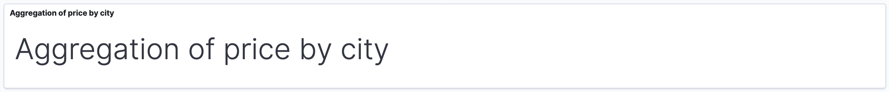
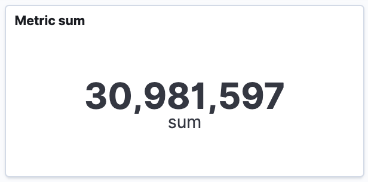
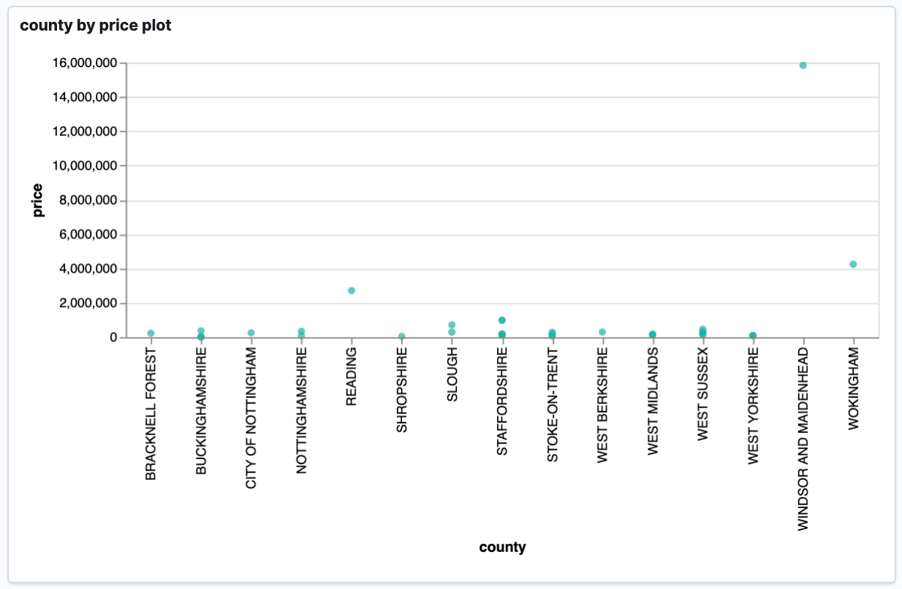
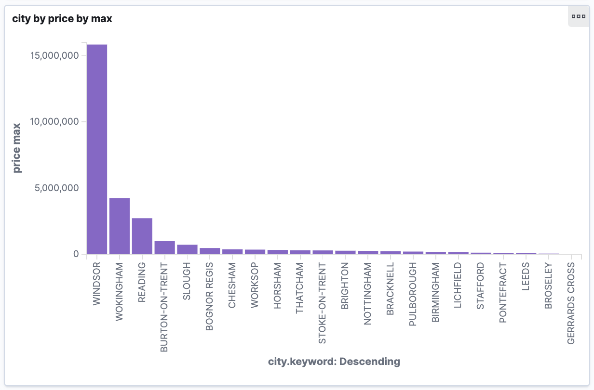
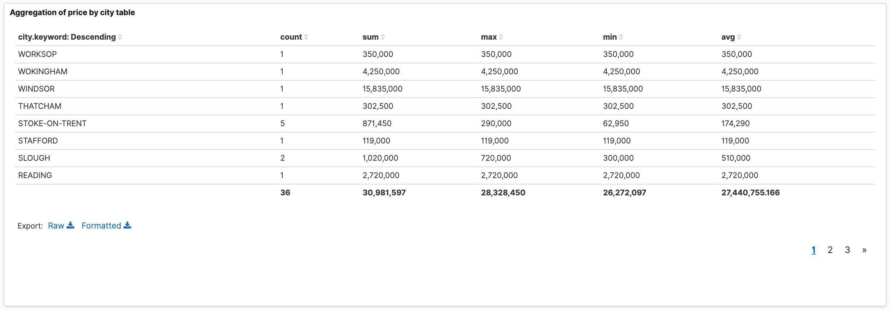
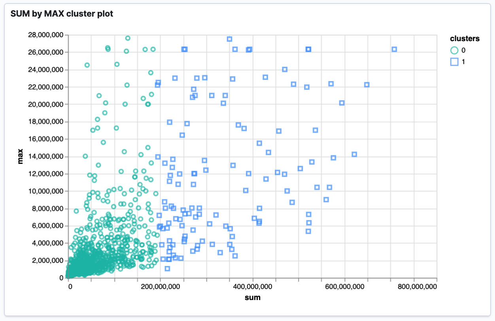

# Elasticsearch Service
Interfaces with the Elasticsearch cluster. Creates index patterns, visualizations and dashboards. This service listens on port 5020 and exposes a [Swagger UI](http://localhost:5020/es/swagger/#/) once it is running.

## Requirements
1. [Docker](https://www.docker.com/)
2. Active docker container runnig Elasticsearch and Kibana

## Run (script)
1. Run docker-config's docker container
2. Navigate to `/elasticsearch-service`
3. Execute `./run`

## Run (manually)
1. Run the docker-config docker container
2. Navigate to `/elasticsearch-service`
3. Execute `npm run build`
4. Execute `npm run start`

## Test
1. Run mongodb-service
2. Navigate to `/elasticsearch-service`
3. Execute `npm run test`

## Supported visualisation types

#### Markup
Name the various dashboard sections

#### Metric
Summarise the result of an operation

#### Scatter plot
Plot data on two axis

#### Bar chart
Display ordered data by a property

#### Data table
Interact with an entire dataset

#### Cluster plot
Cluster data on two features

